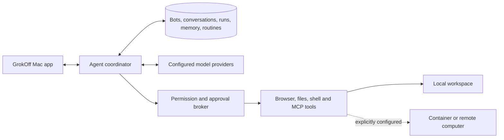

# GrokOff: Mac app design

Date: 2026-10-08. Status: local implementation authorized; research-backed initial release scope. Joe selected the name and authorized reuse of worthwhile open-source components. Local-first execution is an explicitly provisional implementation choice; cloud hosting was offered and no answer has been received.

## Intended outcome

A distinct open-source Mac application that reproduces Grok Bot's persistent coworker workflow: create named bots, message them, delegate real work, see tools and results, intervene at an approval, reuse skills, and schedule routines. The first deliverable is a buildable, locally runnable Mac app with a separate GrokOff identity and data directory. It must retain upstream attribution and cannot claim production parity based only on an interface or simulated provider test.

The research covers published behavior, locally inspected packaging, architectural reconstruction, and suitable components. Exact proprietary prompts, memory algorithms, runtime internals, and serving models remain unknown. See the three reports in `research/`.

## Implementation choice

Evaluate and adapt the Apache-2.0 community edition of [OpenMausBot](https://github.com/milind-soni/OpenMausBot) at commit `3e9e42b3a05e0b7c4edbaedba2e667b851296e27`. Its existing Electron/React/TypeScript shell, agent coordinator, provider drivers, persistence, approval broker, browser tooling, memory, routines, groups, and test fixtures closely match the requested product. Reusing that infrastructure is more useful than replacing it with a chat mockup.

Exclude `enterprise/` and upstream release/deployment automation from the derivative. Preserve Apache license, notices, authorship, and third-party license material. Replace the upstream product name and trademarked mascot in the app's entry surfaces. Do not represent GrokOff as either upstream project or xAI software.

Alternatives considered: a fresh Electron app gives simpler initial ownership but rebuilds substantial runtime behavior; SwiftUI plus a TypeScript daemon gives a native shell but adds another language and packaging boundary. Neither improves the first functional clone enough to justify discarding a credible open-source runtime.

## First implementation scope

1. A separately packaged `GrokOff.app`, its own bundle ID, icon, display name, and `~/.grokoff` workspace. Opening it must not modify the installed Grok Bot, existing OpenMausBot data, or Luna's operational services.
2. The reusable community runtime: bot roster/profiles, direct conversations, group coordination, provider configuration, tools, transcripts, artifacts, skills/memory, routines and approvals.
3. Original author/vendor account services, updater feeds, analytics collection, hosted billing, and implicit connector brokers disabled or removed. Explicitly configured third-party model/tool connections remain available under their own requirements.
4. A reproducible unsigned local Mac build. Public signing/notarization and release publishing are separate release work; no deployment, account creation, public repository or new hosted service is part of this local task.
5. Isolated verification with the upstream fake-engine fixture, plus actual packaged application startup. Simulated provider output is labelled as such. No unapproved paid model calls or real external messages are used for testing.

## Execution boundary

The Mac client owns the UI; the coordinator preserves bot/task state. Provider adapters produce model events; tools perform actual operations through the permission broker. Persisted transcripts, skill files, routines and workspace files survive UI relaunch according to the reused runtime's verified behavior.

Local CLIs can retain the Mac user's privileges. Browser profiles, workspace directories and a permission prompt are not OS sandboxes. The existing container computer feature also does not establish that the model CLI itself is confined to that container. The UI and documentation must state these boundaries. Default to reviewed operation; never silently migrate a Full-access decision from an unrelated workspace. Local execution requires an awake Mac; cloud-style unattended work while it sleeps needs a later remote worker.

## Security and independence requirements

- Every local data/config path defaults to GrokOff's namespace. Test fixtures may override it explicitly.
- Packaged mutation capability and renderer origin restrictions remain intact.
- The app never automatically updates itself into the upstream app or sends product analytics to its maintainer.
- Fork-specific services fail clearly as unavailable until explicitly configured; never replace upstream URLs with invented GrokOff domains.
- Source and package contain no enterprise code. Local fixture tests use temporary HOME and data folders.
- Known shared-service/sessionless Slack dispatch risk is addressed or that mode is disabled for this release; ordinary packaged loopback behavior must not be inaccurately described as that defect.
- Host control, provider auth, connectors and remote access are separate capabilities, each visible to the user.
- An inherited feature is supported only to the extent its relevant build and behavior have been verified in this fork. A model response is not an execution receipt.

## Validation and acceptance

Run type checks and application/server builds. Run relevant Electron auth/updater/default tests, fork independence tests, and request-auth regression tests. Use a disposable fake-engine server to create a bot, send a message, await settlement, inspect the transcript, and verify durable state after restart. Check the actual packaged Mac app boots in a new workspace and exits without orphaning owned helpers. A failed check must be reported and resolved before claiming the corresponding behavior.

Publish a verification record distinguishing: inherited functionality, changes applied, checks passed, provider calls not exercised, container/desktop integration not exercised, and public distribution work remaining.

## Later parity work

After the local foundation is verified: qualify live provider/tool execution with approved test inputs; establish genuine worker isolation; add a user-owned always-on remote worker; validate teaching by demonstration, realtime voice, event-triggered routines and remote takeover; harden and sign a public release. Enterprise SSO, hosted billing and a plugin marketplace are independent service projects, not prerequisites for a useful personal Mac app.
