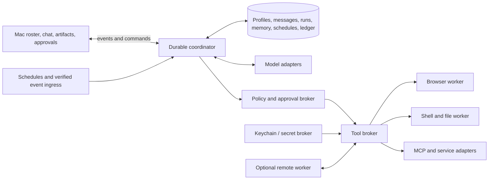

# GrokOff architecture research

Prepared 2026-10-08. Primary-source research plus read-only metadata inspection of the installed Grok Bot Mac app. This document distinguishes published behavior, local observations, and our proposed implementation. No proprietary source, account data, conversations, browser cookies, or credentials were inspected or copied.

## The consequential finding

Grok Bot is a persistent agent product operated on Cursor infrastructure. Its desktop and mobile applications are thin clients; Cursor servers coordinate hosted computers, connected services, and model providers. Each member receives a dedicated Firecracker microVM in the United States. The same member's Bots share that VM; different users are isolated. The official architecture explicitly puts policy, network, model-provider, connector-token, and approval controls at distinct boundaries. [Official architecture](https://docs.x.ai/grok-bot/teams-and-enterprises)

There is no published fixed serving model to clone. Cursor manages model selection, offers no customer-facing model picker, and says the serving mix can change. A request can fail over, and analytics identify its serving model. Enterprise model allowlists are not an unconditional enforcement guarantee. Grok branding therefore does not establish that every Bot turn is served by a Grok model. Connector OAuth tokens stay on Cursor's backend rather than on the hosted computer or in model context. Privacy Mode, provider agreements, and exceptional abuse investigations govern model-data handling. Outside web, command, and plugin content is marked untrusted; defenses reduce prompt-injection risk without eliminating it. Hosting is Cursor-only; on-premises and bring-your-own-image deployment are unavailable. [Official security specification](https://docs.x.ai/grok-bot/security)

**Implication:** we can reproduce the interaction model and agent infrastructure with a model adapter. We cannot truthfully claim identical intelligence, model routing, prompting, or safety behavior. None of those internals is fully public.

## What is actually published

### Execution environment and persistence

All Bots belonging to one account share browser sessions, files, and command-line credentials. Each Bot has a separate screen, allowing concurrent browser/desktop work, but only one computer-use task per Bot screen at a time. Screens are work surfaces rather than credential boundaries. Work continues when the client closes or the laptop closes. `/workspace` holds durable results; normal updates and recovery preserve supported working state. Temporary folders and manually installed packages are replaceable. Reset uses a saved snapshot and may lose recent work. [Computer and apps](https://docs.x.ai/grok-bot/computer-and-apps)

Computer recreation builds a replacement image, preserves durable data, and attempts to pause an active turn safely before switching. Termination stops work and removes the running computer while keeping its durable disk; a later user message starts a replacement. A distinct destructive operation deletes both VM and data. Organization-admin controls are Enterprise-only. [Computer lifecycle](https://docs.x.ai/grok-bot/computers)

### Roster, context, and coordination

A Bot has a profile, description, conversation, and learned working context. Retained context may include preferences, facts, and work summaries; no database, embedding strategy, retrieval algorithm, compaction policy, or memory schema is disclosed. Bot-to-Bot communication uses direct messages, group conversations, and shared files. Duplicating a Bot copies configuration, enabled skills, routines, and avatar; conversation history, learned memory, and attachments are excluded. Template imports create independent copies and do not convey the author's computer or logins. [Bots and memory](https://docs.x.ai/grok-bot/bots)

The design article distinguishes shared capabilities from role-specific context: tools and skills belong to the account; memory and routines belong to the Bot. Group conversations expose project handoffs while preserving specialized context. Its prose sometimes calls the workspace each Bot's computer; operational/security documentation specifies one computer per user with separate Bot screens, so the latter is the implementation boundary to use. [Official product-design explanation](https://x.ai/news/designing-grok-bot)

### Skills, scheduler, and events

Skills encode reusable instructions, decision rules, validation, outputs, and approval boundaries; the private skill library is shared across Bots. Routines identify an owning Bot and invoke workflows on schedules or supported events. Slack/GitHub event integrations are distinct from their tool plugins. Browser demonstration can create a draft skill, recording up to ten minutes of visible interaction without microphone audio. Routines run without the laptop, expose test/history controls, and currently have limits of 50 per Bot, 20 recent run records, and five-minute minimum schedule separation. Test runs perform real actions rather than a dry simulation. [Skills and routines](https://docs.x.ai/grok-bot/skills-routines-and-automations)

### Approvals and sensitive input

Auto Review evaluates tool/computer actions before execution. Ask-first rules override matching automatic-allow rules; an automatic-allow rule still permits review to refuse. Enterprise rules can be enforced and personal rules can be stricter. Local-computer execution has a separate permission setting. Approvals arising from active user chats wait; unattended work approvals expire after approximately ten minutes and do not execute on expiry. Login, 2FA, CAPTCHA, and payment steps are human handoffs. Supported secret forms hide values from chat and the model. Hardware-key use can be forwarded from desktop with explicit approval. Personal review rules are stored on the current desktop and synced to its computer rather than universally identical across installations. [Member approval behavior](https://docs.x.ai/grok-bot/approvals-security-and-privacy)

The security FAQ says the independent reviewer covers shell, plugins, computer actions, automation modifications, and delegation. Memory writes and most settings changes are outside that coverage. Connector blocking does not block visiting the service in the browser: network policy is a separate control. Enterprise can impose destination policy; other teams default to unrestricted network destinations. These are product boundaries, not proof that any single review model catches every dangerous action. [Security FAQ](https://docs.x.ai/grok-bot/security-faq)

Saved Bot secrets use a write-only interface: the Bot sees names/descriptions but not values. Supported flows can fill values into pages without exposing them to the model. Bot secrets are distinct from Enterprise Team Secrets used by setup scripts. Files/shell profiles holding manually added credentials are a separate mechanism and can be lost on computer rebuild. [Secret handling](https://cursor.com/help/grok-bot/secrets)

### Transport, network, and endpoint setup

The client's chat/auth/approval traffic goes to Cursor API domains such as `api2.cursor.sh`. Computer setup, screen, and shell use generated `<computer>.<cluster>.cursorvm.com` hosts. Streaming must pass without buffering; TLS-inspection gateways can break the computer connection while chat still works. This documents separate control paths, without disclosing the complete internal RPC or screen-stream protocol. [Proxy/network transport documentation](https://docs.x.ai/grok-bot/proxies)

Hosted workers run Debian-based Linux with sudo available to setup scripts. Traffic ordinarily leaves shared static egress; desktop routing can use the user's network/IP. Enterprise Team Setup supports admin manifests and network clients, with startup and approximately daily refresh, optional checks, sequential scripts, and timeouts. This is a user-managed VPN/client pattern, not a native private-cloud deployment option. [Private-network and setup architecture](https://docs.x.ai/grok-bot/private-networks)

### Runtime evidence exposed by telemetry

The public wire reference identifies Bots by conversation ID and relates actions through turn, root-turn, subagent, tool-call, and monotonic sequence IDs. It names built-in tools such as shell, read, search, and user delivery; MCP transports include hosted HTTP and worker-local stdio. Computer use is represented as a subagent session. A skill activates when its `SKILL.md` is read. Decisions have separate policy/human/hook/automatic provenance. Tool return success does not necessarily mean an action executed: some denials return ordinary text. Events distinguish cloud/host shell targets, routine starts, file transfers, peer messages, and delegation. Recording is Enterprise opt-in; exported action metadata generally excludes content. These structures show durable coordination and observability, but do not reveal the agent loop's implementation or exact prompts. [Official telemetry wire specification](https://cursor.com/docs/enterprise/opentelemetry-export/wire)

## Local app packaging: observed, not inferred from marketing

Read-only inspection on this Mac found:

| Item | Observed metadata |
|---|---|
| Installed app | `/Applications/Grok Bot.app` |
| App version | `0.68.1` |
| Bundle identifier | `com.anysphere.sand` |
| Desktop framework | Bundled Electron Framework `42.1.0` |
| Desktop minimum OS | macOS `12.0` declared in app metadata |
| Native helper | `Grok Bot Computer Use.app`, executable `CUGrokBotService` |
| Helper identifier | `co.anysphere.grok-bot-computer-use` |
| Helper minimum OS | macOS `14.0` declared in helper metadata |
| Helper permission purpose | Accessibility reads/controls apps; AppleEvents operates apps |
| Signing | Developer ID Application: Anysphere Incorporated; team `DCNK4UB866` |
| Distribution observation | Stapled notarization ticket; installed executable is arm64 |

Evidence files: app `Contents/Info.plist`, Electron framework `Resources/Info.plist`, helper `Contents/Info.plist`; signing metadata from `codesign -dv --verbose=2`. This establishes the inspected build's packaging. It does not establish the newest available build, the renderer framework, backend programming language, GUI-control algorithm, or parity on Intel/Windows/Linux. `app.asar` exists, but its proprietary source was not extracted or copied.

## Our design reconstruction

Everything below is a proposed GrokOff design, not a claim about proprietary Grok Bot internals.

The useful behavior comes from eight cooperating components: a roster/chat interface; durable run coordinator; model adapter; executable tool broker; workspace worker; memory/skill store; scheduler/event ingress; and approval/action ledger. A chat-only wrapper reproduces little of the product. The coordinator must preserve responsibility across UI closure, interruption, approval waits, retries, and routine starts.

### Minimum durable state

Use stable IDs for Bots, conversations, turns, tool calls, routines, approval proposals, artifacts, and events. Store messages and actions as ordered durable events. A SQLite database plus ordinary workspace files is a sufficient first implementation; this is our choice, not their documented storage. Initially use explicit pinned context and source-linked summaries, adding retrieval only when demonstrated workloads need it.

A run state machine should include queued, running, awaiting-human, blocked, succeeded, failed, cancelled, and interrupted. Distinguish a Bot's presence from any particular run's state. A crashed worker is not a completed task; a model-generated success sentence is not evidence of artifact validity. Resume from checkpoints while accounting for side effects already completed.

### Model/runtime contract

Providers need capability declarations: tool calling, vision, structured output, context limits, cancellation, and usage reporting. Persist actual requested/served provider-model identifiers whenever the API discloses them. Keep policy outside the actor prompt. A text-capable model is not automatically adequate for screen operation. A separate vision/computer worker can own UI actions, while the coordinator carries the task and high-level context.

Support BYOK cloud models and a local-model adapter without asserting equal results. Paid subscription access to another app is not automatically an API entitlement. Costs, retry ceilings, and action authorization must be explicit per run or established by the user's policy.

### Tool and secret boundaries

Prefer service APIs/MCP and browser DOM/accessibility operations when available; use screenshot-driven control where needed. Browser profiles should be named and inspectable, with the user choosing shared or dedicated credentials. Browser contexts isolate cookie/storage state, but do not sandbox shell access or create a full security boundary. [Playwright browser-context behavior](https://playwright.dev/docs/browser-contexts)

Keep provider keys and connector refresh tokens in macOS Keychain or a user-owned secret service. The model receives handles and tool results, never raw token values. Secret injection belongs in the execution broker and must be tightly scoped; redact logs before storage/export. A screenshot/page result can still expose a filled secret, so private handoff must suppress sensitive observations rather than merely omit text from the transcript.

Direct Mac automation should live in a separately permissioned helper with an explicit host target. Shell path filters are not a robust sandbox: arbitrary shell programs can reach files indirectly. Isolated VM execution and explicit selected-directory sharing provide a materially stronger boundary.

### Approval semantics worth doing better

Bind every approval to immutable concrete inputs: tool, destination, operation, content/value, resource scope, and proposal version/hash. Never apply an approval to different inputs or silently execute an expired proposal. Policy checks, review verdicts, human approvals, attempts, and execution receipts must be separately recorded. Fail closed on an unavailable reviewer for consequential actions; allow deterministic read-only operations through known scoped policy without asking for every harmless step.

Keep a model reviewer optional within a mandatory broker. A second model can help interpret risk, but deterministic deny/ask rules and OS/workspace isolation must remain authoritative. Every execution route must pass through the broker, including routine creation, Bot delegation, connector writes, file export, and GUI actions. Otherwise a browser click becomes a bypass around API policy.

### Scheduler, notifications, and coordination

Persist schedules with owning Bot, timezone, next occurrence, idempotency/deduplication key, retry policy, and run history. Webhook/event listeners need authentication and narrow matching. Background tasks must stop cleanly for missing login, source failure, exhausted spend, or approval, and report those states distinctly. Route Bot-to-Bot work as attributed events with bounded delegation depth and budgets; group chat is shared task context, not an authority to bypass the user's boundaries.

Notifications should report meaningful completion, failure, or required action. The local daemon can continue when its window closes, but it cannot execute while the Mac sleeps or is off. Restored schedules must have a clear missed-run policy rather than blasting every historical task on wake.

## The Mac topology decision

| Mode | What it gives us | Material limitation |
|---|---|---|
| Mac app + local daemon + dedicated browser | Fastest useful first product; local persistence and automation | Host privileges need care; no work while Mac sleeps/off |
| Mac app + local Linux VM | Separate agent computer, durable disk, safer shell boundary | Image lifecycle, screen streaming, resource use, and OS integration add work; still depends on awake Mac |
| Mac app + user-owned remote worker | Laptop-closed work and remote-screen takeover | Hosting, auth, encryption, lifecycle, and cost management become product responsibilities |
| Hosted multi-user service | Closest operational parity with Grok Bot | Tenant isolation, reliability, abuse control, billing, and connector-token custody are a substantial service |

Firecracker is Apache-2.0 software using Linux KVM; it is suitable for a Linux-hosted worker, not a native macOS hypervisor. [Firecracker primary repository](https://github.com/firecracker-microvm/firecracker)

Apple's Virtualization framework can run Linux on Mac with a guest kernel/initrd matching the Mac's CPU architecture. It is a viable local VM foundation, though building a usable browser desktop and lifecycle layer remains our work. [Apple Linux VM sample](https://developer.apple.com/documentation/virtualization/running-linux-in-a-virtual-machine)

**Recommendation:** keep execution behind one worker interface. Ship a working local Mac experience first, with honest awake-Mac requirements and capability boundaries. An audited existing open-source implementation can supply the interface and coordinator; these requirements do not assume a fresh framework or daemon. Choose whether an isolated Linux worker is first-release scope before implementation. Add a user-owned remote worker for unattended parity without redesigning roster, memory, approvals, or transcripts. The Mac shell can be native or another framework; Grok Bot being Electron does not force GrokOff to be Electron.

## Acceptance criteria for any implementation or fork

These are our proposed checks, and are useful even if an existing community project supplies most of the code:

1. Closing the window does not lose a running job; app quit, Mac sleep, restart, and worker failure each have documented outcomes.
2. A denied send/purchase/delete cannot bypass policy through another tool or a GUI click. The denied action remains visibly denied even if the tool returned explanatory text successfully.
3. Approving a proposal authorizes only its exact target and inputs. Edits and expired approvals require a new decision.
4. Restarting after a completed side effect does not silently repeat it. Unknown execution status asks for reconciliation instead of guessing.
5. A Bot's profile and memory can be exported/deleted predictably. Shared workspace files, shared logins, and routines are separately disclosed and managed.
6. Keys and OAuth tokens never appear in prompts, ordinary transcripts, artifact exports, or action logs; credential handoffs cannot leak screenshots to the actor.
7. Concurrent Bots cannot fight over one screen or overwrite shared artifacts unnoticed. Screen leases, file operations, and dispatch limits are explicit.
8. A missing source, login expiry, provider error, usage ceiling, or permission failure yields an attributable blocked/failed result rather than invented completion.
9. Routine and webhook retries are bounded and deduplicated. The timezone and missed-run policy survive restart and daylight-saving changes.
10. A real demonstration produces a reviewed file, browser result, or service change with evidence; a streamed model response alone does not satisfy execution parity.

## What remains unknown

- Exact actor model mix and routing/failover criteria, reviewer model, prompts, and tool schemas.
- Backend language, queues, conversation/memory databases, summarization cadence, retrieval indexing, and context-selection strategy.
- Computer screen protocol, worker agent implementation, browser control stack, native helper internals, and remote-desktop codec.
- Runtime retry/checkpoint algorithms beyond observable lifecycle and telemetry contracts.
- Precise secret execution flow for every supported connector and arbitrary website.
- Internal unit economics, resource quotas, VM sizing, fleet density, and reliable latency distributions.
- Whether documented or gradually rolled-out controls are enabled on any particular account without live account inspection.

These gaps do not prevent an independent implementation. They prevent claiming source-level cloning or identical behavior. A credible GrokOff should state the behavior it implements, test that behavior, and keep its own architecture inspectable.
